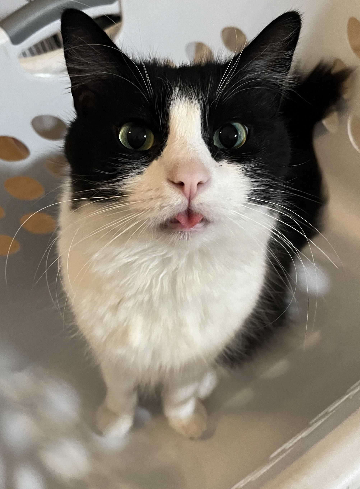

# Genetic Pixel Art | Simulating Evolution For Image Reconstruction

This code has no UI so custom inputs require you to change the image path in the code. The code here is only partially complete and larger simulation tasks do not run well. I may make improvements onesa day if I decide I want higher resolution pixel art of my cats

## Gallery

